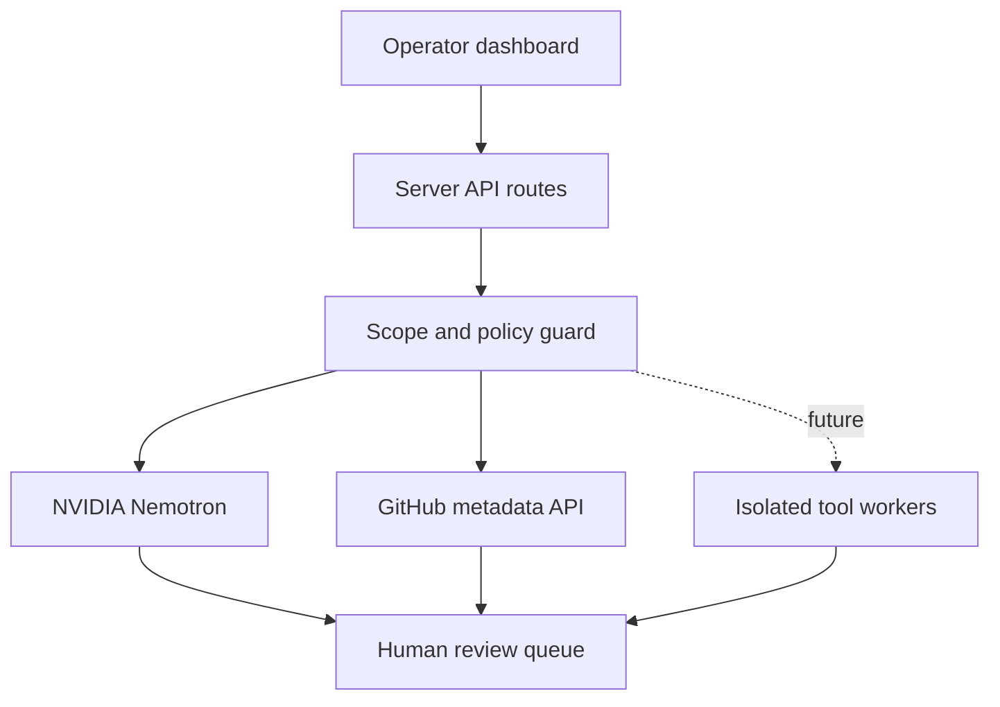

# AiFix3r

AiFix3r is an AI-first security automation command center for authorized bug-bounty programs, internal attack-surface reviews, and controlled labs. It turns plain-language objectives into reviewable mission plans, keeps scope and safety constraints visible, and holds every automated signal for human validation.

The interface is intentionally easy to operate: describe the goal, enter the authorized scope, choose a noise profile, review the proposed workflow, and approve it before execution.

## What is included

- Responsive security operations dashboard
- Cyber-style project discovery lab with program intake and scope validation
- Searchable catalog of 20 discovery, DNS, web, URL, exposure, and validation tools
- Copy-ready passive, balanced, and deep-review shell workflows
- Operator, Ultra Hunter, and Team package previews
- NVIDIA Nemotron mission planning with a deterministic safe-demo fallback
- Exact default model: `nvidia/nemotron-3-ultra-550b-a55b`
- Server-side GitHub repository metadata connection
- Authorization guard, scope confirmation, and human approval messaging
- Mission history, evidence-oriented findings queue, and integration status
- Secret-safe API routes that never send provider tokens to the browser
- Cloudflare/Vinext deployment configuration

## Tool adapter roadmap

AiFix3r is designed to orchestrate established tools through isolated workers rather than reimplement them. Version 0.2 includes guarded, scope-sanitized command templates that users can copy for local use. The web application never executes them. Managed execution adapters remain a roadmap item.

| Stage | Planned adapters | Default policy |
| --- | --- | --- |
| Asset discovery | Subfinder, Amass, Assetfinder, GitHub search | Passive first, allowlisted domains only |
| DNS and ownership | DNSx, MassDNS, CDNcheck | Deduplicate and exclude third parties |
| Web inventory | HTTPx, TLSx, Wappalyzer | Bounded timeouts and metadata collection |
| Crawling and archives | Katana, GAU, Waybackurls | Respect exclusions and URL limits |
| Port visibility | Naabu | Explicit approval and program rate limits |
| Template signals | Nuclei safe tags | Observation only; never auto-report |
| Parameter review | Arjun, ParamSpider | Approved hosts and low concurrency |
| Triage | AiFix3r/Nemotron | Evidence summaries for human review |

The current catalog covers 20 tools, including Subfinder, Amass, Assetfinder, DNSx, MassDNS, CDNcheck, HTTPx, TLSx, Wappalyzer, GAU, Waybackurls, Katana, Uro, Naabu, Nuclei, Arjun, ParamSpider, GF patterns, Dalfox discovery mode, and authorized GitHub CLI search. No exploit execution, credential attacks, destructive testing, denial-of-service, persistence, or scope expansion is built into the product.

## Quick start

Requirements: Node.js 22.13 or newer.

```bash
git clone https://github.com/kalon-xf/aifix3r.git
cd aifix3r
cp .env.example .env.local
npm ci
npm run dev
```

Open the local URL shown in the terminal. Without an NVIDIA key, the planner returns a transparent, deterministic demo plan so the full user journey remains testable.

## NVIDIA configuration

Create a new NVIDIA API key and place it only in the server environment:

```dotenv
NVIDIA_API_KEY=your_new_rotated_key
NVIDIA_MODEL=nvidia/nemotron-3-ultra-550b-a55b
```

The server calls `https://integrate.api.nvidia.com/v1/chat/completions`. The prompt treats all user fields as untrusted data, requires a human authorization gate, and restricts output to conservative planning. Never commit `.env.local` or use `NEXT_PUBLIC_NVIDIA_API_KEY`.

## GitHub connection

Public repository metadata works without a token, subject to GitHub rate limits. For private repositories, configure a fine-grained read-only token:

```dotenv
GITHUB_TOKEN=your_fine_grained_read_only_token
```

The browser submits only `owner/repository`. The server validates that format, calls GitHub, and returns a small normalized metadata object. Tokens and upstream response bodies are not exposed.

## API surface

| Route | Method | Purpose |
| --- | --- | --- |
| `/api/ai/status` | GET | Model and configuration status, never the key |
| `/api/ai/plan` | POST | Build a bounded, reviewable mission plan |
| `/api/github/repository?repo=owner/name` | GET | Normalize repository metadata server-side |

Example planner request:

```json
{
  "goal": "Map public web assets and prioritize changes since the last review.",
  "scope": "example.com",
  "profile": "balanced"
}
```

## Architecture



The repository is the control plane. Future scanner adapters should run in isolated, resource-limited workers with per-program allowlists, egress controls, concurrency caps, audit logs, and kill switches.

## Quality checks

```bash
npm run lint
npm test
```

## Responsible use

Use AiFix3r only against systems you own or have explicit written permission to test. Program scope, exclusions, rate limits, and prohibited techniques always take precedence over a generated plan. Automated output is a lead, not proof of a vulnerability.

See [SECURITY.md](SECURITY.md) for secret handling and vulnerability reporting.

## License

No open-source license has been selected yet. Add one before accepting outside contributions or distributing the project under open-source terms.
